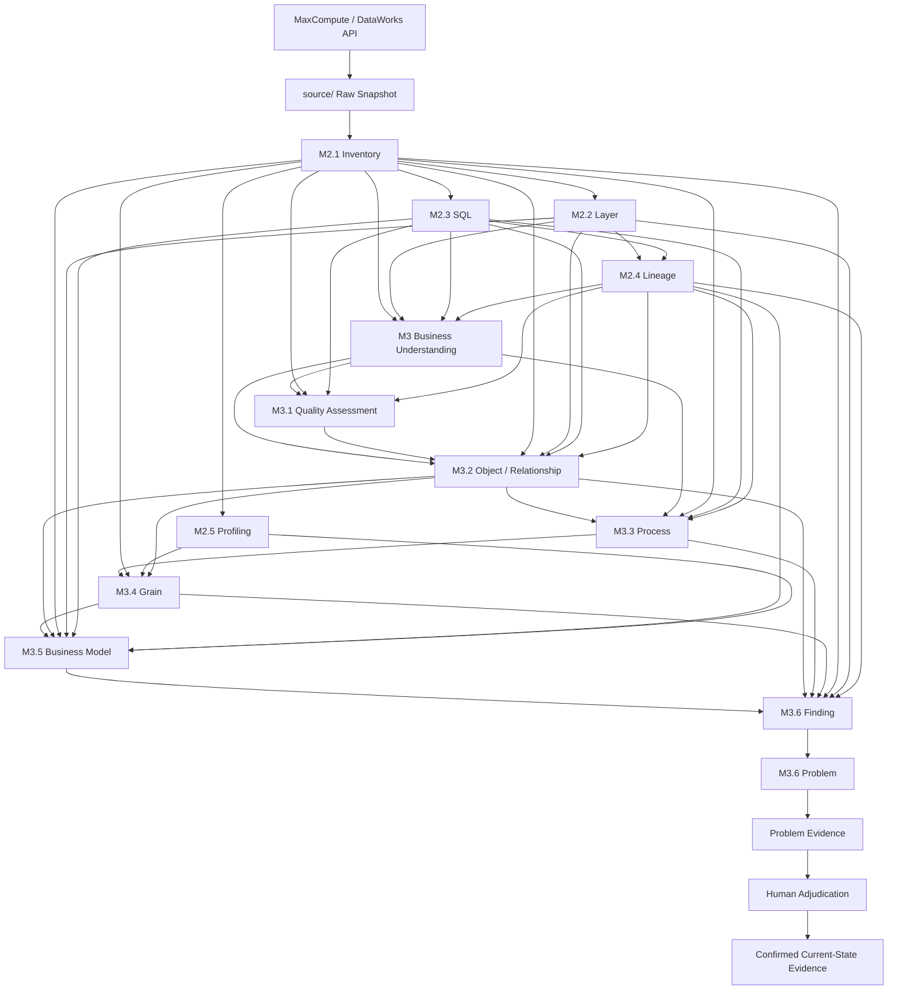

# Current-State Evidence Map

> 本文基于**当前代码**（`src/data_platform_analysis/`）与**当前 `analysis/` 实际产物**编写，回答一个核心问题：
>
> 从 MaxCompute / DataWorks 原始数据开始，到 M3.6 Problem、Evidence 与 Human Decision，**每一步输入什么、做了什么、产出什么、产出代表什么、能证明什么、不能证明什么、为什么下一阶段需要它**。
>
> 文中数量均为本轮读取实际产物所得（标注「本轮实测」）。本文不修改任何代码、产物与配置。

## 1. Purpose

1. **解释链路**：让读者不读源码也能准确说出每阶段的输入 / 输出 / 边界。
2. **固定术语边界**：明确区分 Fact / Signal / Candidate / Finding / Problem / Evidence / Human Decision，避免把机器推断当作业务结论。
3. **作为 M4 的前置读物**：M4（Target DWD Design）必须建立在「已人工确认的 Current-State Evidence」之上，而不是 candidate 数量上。
4. **作为人工裁决的操作地图**：告诉裁决者 1190 条 Problem Candidate 分布在哪里、每条能回溯到什么证据。

本文**不是**代码说明书，也不设计 Target DWD / DWS / Semantic Layer。

**命名说明（以当前代码与 `docs/COMMANDS.md` 为准）**：任务描述把「Business Understanding」称为 M3.1，但当前编号是：

| 当前代码 / COMMANDS 编号 | 阶段 | 命令 |
| --- | --- | --- |
| `M3` | Business Understanding | `analyze-business` |
| `M3.1` | Quality Assessment（只评估不识别） | `analyze-business-quality` |
| `M3.2` | Business Object / Relationship | `analyze-business-objects` |
| `M3.3` | Business Process | `analyze-business-processes` |
| `M3.4` | Grain | `analyze-business-grain` |
| `M3.5` | Business Model | `analyze-business-model` |
| `M3.6` | Current-State Model Review + Problem Assessment | `analyze-current-state-model` |

下文一律使用**当前编号**。

## 2. Evidence Chain Overview



图与代码的差异说明（**不要按想象连线**）：

- **M2.5 Profiling 只依赖 M2.1 Inventory**（`pipeline.py` 中 `MetadataProfiler(inventory)`），**不依赖 Lineage**。
- **M2.4 Lineage 同时依赖 SQL 引用、Inventory 与 Layer**（`LineageBuilder(references, inventory, layer_result.assessments)`）；Layer 只用于给边标注 `source/target_layer_candidate`，不参与建边。
- **M3.6 Finding 与 Problem 是同一条命令**：`analyze-current-state-model` 一次运行先写 5 个 Finding 侧产物，再在同一次运行内把 finding 聚合成 problem 并写出 4 个 Problem / Evidence 侧产物。
- **Evidence 没有独立 CLI、没有独立阶段**（见 §12.3）。
- **读取层级（`layer/assessments.json`）的阶段**：M3、M3.2、M3.5、M3.6（M2.4 另读它做边标注）；**不读层级**：M3.1、M3.3、M3.4。
- **SQL 证据的读取粒度**：`sql/statements.json`（含原文）由 M3、M3.2、M3.3、M3.4 读取；M3.1 与 M3.5 只读 `sql/table-references.json`；**M3.6 两个 SQL 文件都不读**，其 SQL 证据经 finding 的 `evidence_sources` 体现。
- **读取 Profiling 的阶段**：M3.4、M3.5（M3.5 / M3.6 报告只复述能力边界）。

```text
M2（技术事实）
  ↓
M3 / M3.1–M3.5（业务候选）
  ↓
M3.6 Finding（逐条观测）
  ↓
M3.6 Problem（同一根因下的聚合）
  ↓
Evidence（Problem 的可回溯证据行）
  ↓
Human Decision（清单回填 / Workbench）
  ↓
Confirmed Current-State Evidence
```

## 3. Source Data and Raw Snapshot

**Input**：DataWorks OpenAPI（File / Node / 内容）与 MaxCompute（Table / Metadata）API，凭证来自根目录 `.env`。

**Processing**：`export`（= `dataworks` + `maxcompute`）按 Workspace 顺序采集，全量时额外写 `source/manifest.json`（`generated_at` / `sources` / `tool` / `version`）。`summary` 依据已有 Snapshot 重生成 `source/Summary.md`。

**Outputs**（`source/`，本轮实测 12999 个文件，含 `Summary.md`）

| 路径 | 内容 |
| --- | --- |
| `source/dataworks/workspaces-index.json` | Workspace 注册表（读-改-写 upsert） |
| `source/dataworks/workspaces/<id>/files-index.json` | File 导航索引（含 `failed_files`） |
| `source/dataworks/workspaces/<id>/content/` | File 原文（SQL / 脚本） |
| `source/maxcompute/workspaces/<id>/tables-index.json` | 表导航索引（含 `failed_tables`） |
| `source/maxcompute/workspaces/<id>/tables/<table>.json` | 单表元数据 raw JSON（**Source of Truth**） |
| `source/manifest.json` | 全量采集清单 |
| `source/Summary.md` | Snapshot 摘要（含生成时间戳，**唯一非字节确定的文件**） |

**Meaning**：Snapshot 是**当前平台的观测事实**——此刻确实存在这些 Workspace / File / Table / Column 元数据。

**Evidence**：资产存在性、字段名与类型、注释、分区数、生命周期、建表与修改时间、SQL 原文。

**Limitations**：

- **不含任何业务行数据**，也没有数据质量统计。
- 元数据会随平台变化而过期；采集失败记入 `failed_*`，不等于对象不存在。

**Used By**：M2.1 Inventory 是**唯一**读取 `source/` 的分析阶段；M2.2 起只读 `analysis/`，**绝不改写 Snapshot**。

```text
Input:
DataWorks / MaxCompute API 凭证与 Workspace 配置（.env）

Produces:
source/ 下的 File 内容、表元数据 raw JSON、索引、manifest、Summary

Consumed By:
M2.1 Inventory（唯一消费者）

Represents:
当前平台的观测事实（资产存在性 + 元数据 + SQL 原文）

Does Not Prove:
业务含义、数据质量、行级统计、任何建模结论
```

## 4. M2 Technical Evidence

M2 的共同性质：**只描述技术事实与技术推导，不含业务判断**。

### 4.1 M2.1 Inventory

**Input**

- `source/dataworks/workspaces/<id>/files-index.json`
- `source/maxcompute/workspaces/<id>/tables-index.json`
- `source/maxcompute/workspaces/<id>/tables/<table>.json`（与 index 冲突时 raw 优先）

**Processing**：建立统一资产清单与**稳定身份**——`Workspace = workspace_id`、`File = workspace_id + file_id`、`Table = project.table`（`table_key`，不含 schema）。**不做层级判定**（归 M2.2），**不读 SQL 内容**（归 M2.3）。

**Outputs**（本轮实测 5 个文件）

| 文件 | 内容 | 数量 |
| --- | --- | --- |
| `analysis/inventory/workspaces.json` | Workspace ↔ MaxCompute project、`file_count` / `table_count` / `resource_count`、快照标记 | 3 |
| `analysis/inventory/files.json` | `file_id` / `node_id` / `file_name` / `file_type` / `use_type` / `task_type` / `content_file` / `raw_file` | 4651 |
| `analysis/inventory/tables.json` | `table_key` / `comment` / `column_count` / `partition_count` / `size` / `lifecycle` / `is_virtual_view` / `creation_time` / `last_modified_time` / `raw_file` | **3719** |
| `analysis/inventory/columns.json` | `table_key` / `column_name` / `data_type` / `comment` / `is_partition` / `ordinal` | **102603** |
| `analysis/inventory/summary.md` | 本阶段报告 | — |

**Meaning**：回答「**当前平台到底有哪些数据资产**」——表、字段、分区、表元数据、Workspace 与 MaxCompute project 对应关系。`table_key` 是**全链路主键**：Layer / SQL / Lineage / Profiling / M3 / M3.6 每条记录都用它对齐。

**Evidence**

- **事实**：某表存在、N 个字段、有无分区、view 还是物理表、注释文本、生命周期。
- **推导**：无，本阶段不产生任何候选。

**Limitations**

- `comment` 为空不代表表没有业务含义。
- 只覆盖被采集的 Workspace；未配置 / 采集失败的资产不在清单里。
- 层级、业务域、粒度**都不是** Inventory 的产出。

**Used By**：M2.2 做层级规则匹配；M2.3 过滤 NodeId 有效的可分析文件；M2.4 补全 project 并判定 `in_inventory`；M2.5 直接以它为输入；M3 → M3.6 全部以 `tables.json` / `columns.json` 为字段与身份来源。

```text
Input:
source/ 的 files-index、tables-index、表 raw JSON

Produces:
analysis/inventory/{workspaces,files,tables,columns}.json + summary.md
（本轮：3 workspace / 4651 file / 3719 table / 102603 column）

Consumed By:
M2.2、M2.3、M2.4、M2.5，以及 M3 → M3.6 全链

Represents:
平台资产的观测事实与稳定 table_key 身份

Does Not Prove:
层级归属、业务含义、数据质量、任何建模结论
```

### 4.2 M2.2 Layer

**Input**：`analysis/inventory/tables.json` + `config/layer-rules.yaml`（version 1.0）。

**Processing**：两层语义，不可混用：

1. **Workspace Layer（配置事实）**：按 `workspace_id` 查表。当前配置 `466338 → ODS`、`466337 → CDM`、`466339 → ADS`。
2. **Sub Layer（现状识别规则）**：仅对 `CDM` 再做表名前缀匹配——`dwd_ → DWD`、`dws_ → DWS`、`dim_ → DIM`（大小写不敏感，`suffixes` 当前为空）。`ODS` / `ADS` 的 `candidate_layer` **直接等于** `workspace_layer`，不做表名识别；其它层的前缀命中只记入 `evidence`（跨层命名提示），不改变 candidate。

判定结果 `status ∈ {MATCH, UNKNOWN, CONFLICT}`（`LAYER_STATUS_*`）。

**Outputs**：`analysis/layer/assessments.json`（3719 行）+ `summary.md`。字段 `workspace_layer` / `candidate_layer` / `status` / `evidence`（`type = workspace | prefix`）。

本轮实测：

| 维度 | 分布 |
| --- | --- |
| `workspace_layer` | ADS 1475、ODS 1175、CDM 1069 |
| `candidate_layer` | ADS 1475、ODS 1175、DWD 898、DWS 61、DIM 49、**未定 61** |
| `status` | **MATCH 3658、UNKNOWN 61、CONFLICT 0** |

**Meaning**：回答「**当前表被如何判断所属数据层**」——一条**可解释的规则命中记录**：谁命中了什么，是否唯一命中。

**Evidence**

- **事实**：该表属于哪个 Workspace（`workspace_layer` 是配置事实）。
- **规则推导**：`candidate_layer`（ODS/ADS 来自配置，DWD/DWS/DIM 来自命名前缀）。
- **不确定**：61 张 CDM 表既无 `dwd_` / `dws_` / `dim_` 前缀也无其它证据 → `UNKNOWN`（`candidate_layer = null`）。`CONFLICT` 本轮 0 条。

**Limitations**

> **Layer Assessment 是规则判断，不等于业务人员已经确认的数据架构。**

- `candidate_layer = DWD` 只说明表名以 `dwd_` 开头，**不说明它已按 DWD 标准建模**。
- 反例客观存在：`dme_ads.dwd_crm_member_item` 位于 ADS Workspace → `candidate_layer = ADS`，`evidence` 同时记下 `prefix dwd_` 的跨层命名提示。
- 任何后续阶段都**不改写**层级；M3 只读取 `warehouse_layer` / `candidate_sub_layer`。

**Used By**：M2.4 给血缘边标注 `source/target_layer_candidate`；M3 写入 `warehouse_layer` / `candidate_sub_layer`；M3.5 判定 `candidate_layer`；M3.6 判 current role / stage；Workbench 读取它作为 Affected Tables 的 Layer（可降级）。

```text
Input:
analysis/inventory/tables.json + config/layer-rules.yaml

Produces:
analysis/layer/assessments.json（3719 行）+ summary.md

Consumed By:
M2.4 血缘标注、M3 / M3.1 / M3.2 / M3.5 / M3.6、Workbench（可降级）

Represents:
层级候选（workspace 配置事实 + 命名前缀规则命中）

Does Not Prove:
已确认的分层架构、表是否符合 DWD / DWS 标准
```

### 4.3 M2.3 SQL

**Input**：`analysis/inventory/files.json` 中 NodeId 有效（`is_analysis_eligible`）的 File 及其 `content_file` 原文。

**Processing**（`analysis/sql/`）：

1. **Statement splitting**：按 ODPS SQL 规则把一个脚本切成语句（`split_statements`）。
2. **Parser Compatibility Normalization**（`normalization.py`）：只改 syntax context（如全角括号、注释处理），产出 `normalizations` / `normalization_applied`；**归一化后仍走 AST 解析**。
3. **解析**：`sqlglot.parse(sql, dialect="odps")`。sqlglot 官方无 ODPS 方言，`dialect.py` 注册**基于 Hive 的 ODPS 别名**（`class ODPS(Hive)`）。
4. **Fallback Extraction**（`fallback.py`）：仅对 CTAS 在解析不适用时做**基于 token 的** source / target 抽取，`extraction_method = fallback`；与 Normalization 是两个独立阶段，互不混用；CTE 名（`WITH ... AS`）被剔除。

**Raw SQL 与 normalized SQL 的关系**：`statements.json` 的 `sql` 字段保存**原文（事实来源）**，归一化结果记在 `normalizations` / `normalization_applied`；`table-references.json` 用 `file_id + statement_id` 回指原文。

**Outputs**（本轮实测）

| 文件 | 内容 | 数量 |
| --- | --- | --- |
| `analysis/sql/statements.json` | `sql` / `parse_status` / `normalization_applied` / `normalizations` / `extraction_method` / `dialect` / `content_file` | **1963** |
| `analysis/sql/table-references.json` | 语句级 `source_tables[]` / `target_tables[]` / `extraction_method` | **1273 行**（source 3462、target 1272） |
| `analysis/sql/parse-errors.json` | 解析失败记录 | **0** |

本轮：`parse_status = success` 1963/1963；`extraction_method` = `ast` 1962、`fallback` 1；`normalization_applied = true` 1。

**Meaning**：回答「**当前 SQL 分析提取了什么**」——哪段脚本、哪条语句，从哪些表读、写到哪张表，即**技术处理逻辑的引用关系**。

**Evidence**

- **事实**：SQL 原文存在且可读（`content_file` 指向 `source/`）。
- **机器抽取**：source / target 表清单（AST 或 token fallback）。
- `parse_status = success` 只表示「解析器接受了这段语法」，**不表示**「SQL 业务上正确 / 会按预期运行」。

**Limitations**

- ODPS 方言是 Hive 别名，**专有语法可能解析偏差**；`parse-errors.json = 0` 只说明本轮无语法报错。
- 只抽**表级引用**，不还原字段级加工、不解析过滤条件语义、不评估 SQL 质量。
- `table-references` 是**语句级**的，不等于脚本级依赖。

**Used By**：M2.4 建血缘边；M3 用 SQL 关键词补 Direct Evidence；M3.2 / M3.3 / M3.4 把 `sql` 作为 evidence source；M3.6 证据可回溯到 `file_id + statement_id`。

```text
Input:
analysis/inventory/files.json（NodeId 有效）+ source/ 中的 SQL 原文

Produces:
analysis/sql/{statements,table-references,parse-errors}.json
（本轮：1963 语句 / 1273 引用行 / 0 解析错误）

Consumed By:
M2.4 Lineage、M3、M3.2、M3.3、M3.4、M3.6

Represents:
语句级技术处理逻辑（谁被读、谁被写）与可回溯的原文位置

Does Not Prove:
业务意图、SQL 正确性、字段级加工语义、调度依赖
```

### 4.4 M2.4 Lineage

**Input**：`analysis/sql/table-references.json` + `analysis/inventory/*` + `analysis/layer/assessments.json`。

**Processing**（`analysis/lineage/`）：

1. **引用补全与解析**（`references.py`）：把裸表名补成 `project.table`；**剔除 CTE 别名**。
2. **建边**：`edge = (workspace_id, source_key, target_key)`，**同一条边只保留一次**，多条 SQL 证据全部收进 `evidence[]`。
3. **不推断业务含义**；`source/target_layer_candidate` 直接取 M2.2 的 `candidate_layer`，M2.4 不自行判定层级。
4. **核心表候选**：按上下游计数产出 `core-table-candidates.json`，标记 `in_inventory`。

**Outputs**（本轮实测）

| 文件 | 内容 | 数量 |
| --- | --- | --- |
| `analysis/lineage/table-lineage.json` | `source_key` / `target_key` / `source_table` / `target_table`（保留 SQL 原始写法）/ `workspace_id` / `source\|target_workspace_id` / `source\|target_layer_candidate` / `evidence[]` | **3442 边** |
| `analysis/lineage/core-table-candidates.json` | `upstream_count` / `downstream_count` / `evidence_count` / `in_inventory` / `layer_candidate` | **1789**（`in_inventory=true` 1765 / `false` 24） |
| `analysis/lineage/summary.md` | 报告 | — |

本轮：**跨 Workspace 边 1592**；**自环（source = target）0 条**。

**Source → SQL → Target**

```text
source_table（SQL 原始写法）
    ↓ 同一 statement_id 的抽取
SQL 语句（M2.3，可回溯 content_file）
    ↓ 规范化为 project.table
edge.source_key ──────────────► edge.target_key
```

**Evidence**

- **事实**：某语句引用了哪些表、去重后的表级数据流向、边的证据条数。
- **跨 Workspace 关系**：1592 条边属于技术上的跨 workspace 流转（**技术关系**）。

**Limitations**

> **SQL / Lineage 证据 ≠ 业务关系确认。**

- 只描述**数据流向**：A 进 B 不代表「A 是 B 的业务上游主数据」。
- `in_inventory = false` 的 24 个 key 是引用解析出的外部 / 异常表，**不构成事实**。
- 核心表候选是**拓扑与证据计数**的结果，不是「业务核心表」的确认。
- 无血缘不等于无依赖（外部调度、手工链路、跨引擎读取不在证据范围内）。

**Used By**：M3 补业务证据；M3.2 作 object relationship 的一类证据；M3.3 / M3.4 作 evidence source；M3.5 判定聚合表是否有事实上游；M3.6 的 `relationship_*` / `aggregate_fact` finding 与根因（如 `MULTIPLE_SOURCE_SYSTEM_REPLICATION`）依赖它。

```text
Input:
analysis/sql/table-references.json + analysis/inventory/* + analysis/layer/assessments.json

Produces:
analysis/lineage/{table-lineage,core-table-candidates}.json + summary.md
（本轮：3442 边、跨 workspace 1592、核心候选 1789）

Consumed By:
M3、M3.1、M3.2、M3.3、M3.4、M3.5、M3.6

Represents:
去重后的技术数据流（Source → SQL → Target）与拓扑核心候选

Does Not Prove:
业务关系、权威表、调度依赖、数据是否真实流转成功
```

### 4.5 M2.5 Profiling

**Input**：`analysis/inventory/tables.json` + `analysis/inventory/columns.json`（**仅 Inventory**）。

**Processing**：`MetadataProfiler(inventory)` 只读表元数据，代码写死三条约束（`profiling.py` 文件头）：

1. `profile_status` **恒为** `metadata_only`。
2. `data_sample_available` **恒为** `false`。
3. 需要扫数据才能得到的统计量（`row_count` / `distinct_count` / `null_count` / `min_value` / `max_value` / `sample_values`）**一律为 `null`，不伪造**。

`evidence.source = maxcompute_table_metadata`，带 `index` / `raw_file` 回指 Snapshot。

**Outputs**（本轮实测）

| 文件 | 内容 | 数量 |
| --- | --- | --- |
| `analysis/profiling/tables.json` | `column_count` / `partition_count` / `size` / `row_count=null` / `data_sample_available=false` / `is_virtual_view` / `profile_status` | 3719 |
| `analysis/profiling/columns.json` | `data_type` / `is_partition` / `distinct_count=null` / `null_count=null` / `min\|max_value=null` / `sample_values=null` / **`is_candidate_key=false`** / `profile_status=metadata_only` | 102603 |
| `analysis/profiling/summary.md` | 报告 | — |

本轮：`row_count` 全 `null`（3719/3719）；`is_candidate_key = true` 的列 **0**（102603 列全 false）；`distinct_count` / `null_count` / `min\|max_value` / `sample_values` 全 `null`。

> **这是 metadata-only profiling，不是 data quality profiling。**

**Meaning**：回答「**当前项目知道哪些数据统计信息，又不知道哪些**」——它是一份**能力边界声明**。

**Evidence**：只有元数据事实（列数、分区数、类型、是否分区列、size、是否 view）。

**Limitations**

> 当前 profiling **没有访问业务行数据**，因此**不能证明**唯一性、完整性、分布、数据质量、主键有效性、取值域。

- `is_candidate_key = false` **不等于**「这些列不是候选键」，而是「**没有行级证据可判断**」。
- 这直接决定了 M3.4 的候选键只能靠形态推断（见 §5.5）。

**Used By**：M3.4 判断字段形态与 `metadata_only` 能力边界；M3.5 在报告中复述该边界；M3.6 finding 显式标注「无行级唯一性证据」。

```text
Input:
analysis/inventory/{tables,columns}.json（仅元数据）

Produces:
analysis/profiling/{tables,columns}.json + summary.md
（3719 表 / 102603 列，全部 profile_status=metadata_only）

Consumed By:
M3.4 Grain、M3.5 Model（能力边界与字段形态）

Represents:
「我们对数据知道什么、不知道什么」的元数据能力边界

Does Not Prove:
唯一性、完整性、分布、数据质量、主键有效性
```

## 5. Core Vocabulary（七个词的边界）

后面每一阶段都按同一套词说话。这七个词在本项目里有**固定含义**，混用会导致把机器推断当成业务结论。

| 词 | 产出位置 | 定义 | 当前数量 | 绝不等于 |
| --- | --- | --- | --- | --- |
| **Fact（观测事实）** | `source/`、M2.1、M2.3 原文 | 平台上客观存在、可回指原始位置的内容：表 / 列 / 注释 / SQL 原文 | 表 3719、列 102603、语句 1963 | 不等于「正确」，只等于「存在」 |
| **Signal（信号）** | M3.3 `process-signals.json`、M3.4 `grain-signals.json`、M2.5 元数据特征 | 某条**规则**在字段 / 表上被命中（有 event_time 列、有 amount 列、命名含 dwd_ 等） | process signal 12712、grain signal 22436 | 不等于对象、不等于过程、不等于 grain |
| **Candidate（候选）** | M2.2 `candidate_layer`、M3 / M3.2–M3.5 各 candidate 文件 | 机器按规则 / 证据推断出的**待确认结论**，`status = candidate` | 层级 3719、domain 表 3285、object 5、process 17、grain 5679、fact 3364、dimension 5、关系 15979 | 不等于 confirmed，不等于架构事实 |
| **Finding（评审发现）** | M3.6 `model-review-findings.json` | 机器对**已存在形态**的一次异常观测，每条都带 evidence、`status = candidate` | 4439（P0 696） | 不等于问题，不等于「错了」 |
| **Problem（候选问题）** | M3.6 `current-state-problems.json` | 同一根因下 finding 的**聚合**（一个根因 + 一组证据 + 一个 human_question） | 1190（candidate 1148 / review_required 42 / confirmed 0） | 不等于 Finding Count，不等于 Confirmed Problem |
| **Evidence（证据行）** | M3.6 `current-state-problem-evidence.json` | 每条 problem 的**可回溯证据行**（指向 finding / table / column / process / grain / lineage …） | 1190 条 problem、30201 行、单条上限 50 行 | 不等于结论，只是「为什么会被提出」 |
| **Human Decision（人工裁决）** | 清单 `human_status / human_name / note` 回填 → 重跑 | 人对某条 candidate 给出的受支持取值，经确定性映射写回 `status` | 当前 **0 条**（所有清单全 pending / false） | 不是自动生成，不是 Workbench 里的按钮状态 |

**确定性映射（代码事实，`models.py`）**

```text
清单 human_status ── normalize_human_status ──► MODEL_STATUS_BY_HUMAN_STATUS
pending            → candidate
confirmed          → confirmed    （此时 human_validated = true）
rejected           → rejected
needs_review / needs_discussion → needs_discussion（problem 侧为 review_required）

只能识别受支持取值；其余一律按「未回填」处理，不会猜测。
```

**四条不可违反的等式**

```text
Observation（观测）        ≠ Problem（问题）
Candidate（候选）          ≠ Confirmed（已确认）
Finding Count（4439）      ≠ Problem Count（1190）≠ Confirmed Problem Count（0）
Evidence Strength（证据强弱）≠ Confidence（置信度）≠ 业务正确性
```

## 6. M3 Business Understanding（命令 `analyze-business`）

### 6.1 Input

**必需输入（缺失即报错，不自动回退跑前置阶段）**——`M2_INPUT_FILES`：

| 文件 | 提供什么 |
| --- | --- |
| `inventory/tables.json`、`inventory/columns.json` | 表 / 列身份与注释 |
| `sql/statements.json`、`sql/table-references.json` | SQL 原文位置与表级引用 |
| `lineage/table-lineage.json`、`lineage/core-table-candidates.json` | 技术血缘与拓扑核心候选 |
| `layer/assessments.json` | `warehouse_layer` / `candidate_sub_layer` |

**配置**：`config/business-rules.yaml`（业务词典：domain / object 关键词与 stopwords）。

**可选人工输入**：无（M3 不读任何清单）。

### 6.2 Processing

1. 用业务词典在 **table_name / table_comment / column_name / column_comment / SQL** 五类位置匹配关键词，产出 Evidence 条目。
2. 关键词 → domain candidate、object candidate，并按命中证据算 `confidence`（≥3 类证据 = high，2 类 = medium，仅表注释命中 = medium，其余 = low）。
3. `is_core_candidate` 依据 M2.1 字段 + 血缘拓扑核心候选。
4. 稳定排序、确定性编号，重跑结果可比对。

### 6.3 Outputs（本轮实测）

| 文件 | 内容 | 数量 |
| --- | --- | --- |
| `business/terms.json` | 词典命中业务词 + 命中次数 + 来源 | **6032**（top：channel 5465、product 5125、store 4132） |
| `business/tables.json` | 每表的 `warehouse_layer` / `candidate_sub_layer` / `is_core_candidate` / `business_terms` / `domain_candidates` / `business_object_candidates` / `evidence` | **3719** |
| `business/domains.json` | 4 个 domain（customer 1848 / inventory 1096 / product 2170 / sales 2622 表） | **4** |
| `business/objects.json` | 5 个 object（customer 1848 / employee 20 / order 1416 / product 2170 / store 1741 表） | **5** |
| `business/summary.md` | 本阶段报告 | — |

分布实测：`domain_candidates` 数量 0→434、1→825、2→1081、3→767、4→612 表；`is_core_candidate=true` **1753**；证据条目（表级累加）`column_name 21962`、`column_comment 14176`、`sql 7403`、`table_name 2422`、`table_comment 1093`、**`lineage 0`**。

### 6.4 Meaning

回答「**当前平台的表在业务上看起来属于哪些领域 / 对象，哪些表被推断为核心表**」。它是**词典匹配的统计结果**，是后续所有业务阶段的语义地基。

### 6.5 Evidence

- **事实**：表名、注释、列名、列注释、SQL 命中了哪些关键词（每条 evidence 都带 `keyword` 与来源位置）。
- **推导**：domain / object 候选与 confidence（规则推导）。

### 6.6 Limitations

- 词典覆盖率决定一切：**未收录的同义词、外语注释、缩写不会被识别**。
- `lineage` 证据类型在代码中支持，但本轮 **0 条命中**——M3.1 的 `high_with_lineage = 0`、`by_source_type.lineage.entry_count = 0` 同步为 0，即**当前 domain / object 候选没有一条使用了血缘证据**。既有代码分析记录的成因：血缘邻居表名的关键词在本数据集上**总是**已被本表名 / 注释或引用它的 SQL 覆盖（SQL 里通常写着邻居表名），按防膨胀规则不再重复记入（见 `docs/CODE_LOGIC_ANALYSIS.md`）。因此「M3 读了 lineage」**不等于**「lineage 参与了判定」。
- 434 张表没有任何 domain 候选（UNKNOWN），612 张表同时命中 4 个 domain（高度歧义）——**这恰好说明它需要 M3.1 而不是被当作结论**。
- 本阶段不读 config 之外的任何人工输入，**没有 confirmed 概念**。

### 6.7 Used By

M3.1（质量基线）、M3.2（object 归属）、M3.3（过程对象）、M3.6（对象证据）；`warehouse_layer` / `candidate_sub_layer` 被 M3.5 / M3.6 复用。

```text
Input:
M2 的 inventory / sql / lineage / layer 七个 JSON + config/business-rules.yaml

Produces:
analysis/business/{terms,tables,domains,objects}.json + summary.md
（6032 词 / 3719 表 / 4 domain / 5 object）

Consumed By:
M3.1、M3.2、M3.3、M3.5、M3.6

Represents:
词典匹配得到的 domain / object / core 业务候选与证据条目

Does Not Prove:
业务归属正确、表确实是核心表、domain 边界合理、血缘参与了判定
```

| Can | Cannot |
| --- | --- |
| 说明某表为何被推到 `sales` domain（逐条 keyword 证据） | 替业务方确认这张表就属于 sales |
| 统计有候选 / 无候选的表数量 | 判定无候选的表「没有业务含义」 |
| 给出 `is_core_candidate` 的推断值 | 证明该表是核心资产或权威源 |

## 7. M3.1 Business Quality Assessment（命令 `analyze-business-quality`）

> 注意：M3.1 是**质量评估**（只评估不识别），业务词识别属于 M3；本阶段**不新增** domain / object。

### 7.1 Input

`M2 / M3 产物缺失，无法执行…`——9 个必需文件：`business/{tables,domains,objects,terms}.json` + `inventory/{tables,columns}.json` + `sql/table-references.json` + `lineage/{table-lineage,core-table-candidates}.json`。**不读 config，不读清单。**

### 7.2 Processing

按表聚合证据覆盖与歧义度，产出三类判断：

- **covered / ambiguous / unknown**：有候选 / 多候选 / 无候选。
- **unknown 主因**：`comment_evidence_present`（有注释但词典没命中）、`naming_evidence_present`、`sql_evidence_present`、`insufficient_evidence`、`evidence_sparse`。
- **core 表交叉复核**：核心表里有多少是 unknown / ambiguous / high。
- 生成三档人工复核清单 `review-checklist.md`。

### 7.3 Outputs（本轮实测）

| 文件 | 内容 | 数量 |
| --- | --- | --- |
| `business/quality-assessment.json` | `summary` / `unknown` / `ambiguous` / `evidence_quality` / `confidence_review` / `core_table_review` | 1 份 |
| `business/quality-assessment.md` | 报告 | — |
| `business/review-checklist.md` | 3 个分区的人工回填清单 | **3 区 / 148 行 / 全 pending** |

`summary` 实测：`table_count 3719`、`term_count 6032`、`covered 3367`、`unknown 352`、`ambiguous 2587`、`core 1753`、`core_unknown 48`、`core_ambiguous 1560`、`core_high 913`、`core_low_evidence 274`、`core_flag_mismatch 0`。

- `unknown.by_reason`：`comment_evidence_present 213`、`naming_evidence_present 128`、`sql_evidence_present 11`、`insufficient_evidence 0`、`evidence_sparse 0`（`core_unknown_count 48` 为重叠标记，不计入合计）。
- `ambiguous.by_reason`：`multi_domain_likely 800`、`evidence_conflict 734`、`dominant_domain 417`、`keyword_cooccurrence 360`、`unresolved 276`；`by_type`：domain 2460、object 2203、domain_and_object 2076。
- `evidence_quality.by_diversity`（表级证据类型数）：0→352、1→638、2→1104、3+→1625。
- 清单三档（**每档 ≤50 行**）：`Priority 1 — 核心表 + UNKNOWN（共 48 条）`、`Priority 2 — 核心表 + AMBIGUOUS（共 1560 条）`、`Priority 3 — 非核心表 + AMBIGUOUS（共 1027 条）`。

### 7.4 Meaning

回答「**当前的业务语义识别有多可靠、哪些表的证据不足或多义、复核应该先看谁**」——这是一份**证据质量基线**，把「识别」和「识别得怎么样」分开。

### 7.5 Evidence

- **事实**：证据类型数（diversity）、每类证据覆盖的表数、UNKNOWN 主因分布。
- **推导**：covered / ambiguous / unknown 分类与三档复核优先级。

### 7.6 Limitations

- `UNKNOWN` **只表示现有词典与证据无法给出候选**，`note` 明确写着「不代表表没有业务含义」。
- `confidence` 是**证据类型数算出的候选等级**，不是业务确认（`confidence_review.note` 原文）。
- 213 张 UNKNOWN 表**有注释但词典没命中**——这是词典缺口，不是数据缺陷。
- 清单只是 ≤50 行的抽样视图（合计 148 行 / 2635 条待复核），**未出现在清单里的表同样没有被裁决**。

### 7.7 Used By

M3.2 / M3.3 读取 `review-checklist.md` 作为**表级人工确认的唯一来源**；报告向 M3.6 与 Workbench 复述能力边界。

```text
Input:
business/{tables,domains,objects,terms}.json + inventory/* + sql/* + lineage/*（9 个，必需）

Produces:
analysis/business/{quality-assessment.json,quality-assessment.md,review-checklist.md}
（3719 表：covered 3367 / unknown 352 / ambiguous 2587；清单 148 行）

Consumed By:
M3.2（quality-assessment.json + review-checklist.md）、M3.3（review-checklist.md）

Represents:
证据覆盖与歧义的量化基线 + 人工复核入口

Does Not Prove:
表没有业务含义、confidence = 业务正确、清单之外的表已复核
```

| Can | Cannot |
| --- | --- |
| 说明 352 张 UNKNOWN 表分别缺什么证据 | 宣布这些表「无业务含义」 |
| 给出 2587 张歧义表的主因分布 | 替人决定它属于哪个 domain |
| 规定人工复核的优先顺序 | 产出任何 confirmed 结论 |

## 8. M3.2 Business Object & Relationship（命令 `analyze-business-objects`）

### 8.1 Input

**必需**（`INPUT_FILES`，缺失报错）：10 个数组文件 `business/{objects,tables,domains}.json`、`inventory/{tables,columns}.json`、`sql/{statements,table-references}.json`、`lineage/{table-lineage,core-table-candidates}.json`、`layer/assessments.json` + `business/quality-assessment.json` + `business/review-checklist.md`。

**人工回填输入**：`review-checklist.md` 的 `human domain / human object / status`（**唯一**人工确认来源；缺列报错）。

### 8.2 Processing

1. **不二次分类 Object**：Object 清单直接沿用 `objects.json`（+ 人工回填新增的），`objects-registry.json` 只登记状态。
2. 把 Object → Table 的归属整理成 `associations`（**表级归属记录**，不是业务关系）。
3. 从 SQL / 血缘 / 共现三类证据中抽取**表对**，产出 object 之间的候选关系。
4. 人工回填的 `human domain / human object` 被解析后写回 association / registry 状态。

### 8.3 Outputs（本轮实测）

| 文件 | 内容 | 数量 |
| --- | --- | --- |
| `business/objects-registry.json` | 5 个 object 的状态登记（`status_counts`） | **5**（candidate 5 / confirmed 0 / rejected 0 / needs_discussion 0） |
| `business/object-tables.json` | Object ↔ Table 的 `associations[]` | **7195** |
| `business/object-relationships.json` | object 对之间的候选关系 | **10** |
| `business/object-evidence-matrix.json` | 每个 object 的证据源统计（只做事实汇总） | 5 行 |
| `business/object-graph.md` | 可视化报告 | — |

关系实测：10 条全部 `relationship_type = candidate`、`evidence_diversity = 3`、`evidence_strength = strong`，三类证据 **co_occurrence 6344 / sql_reference 13478 / lineage 13363 条目**，`sql_statement_count 1107`。

`note` 原文（关键边界）：「relationship_type 恒为 candidate：co_occurrence / sql_reference / lineage 只是表级证据，不等于业务关系，不产出 owns / contains / belongs_to / one-to-many / many-to-many；evidence_strength 只反映证据类型数。」

### 8.4 Meaning

回答「**当前平台里 Object 与表、Object 与 Object 之间被什么证据连起来**」——把 M3 的散点候选整理成**可回溯的结构化证据**（谁、哪张表、哪类证据、多少条）。

### 8.5 Evidence

- **事实**：某表被归入某 object（含 confidence 与逐条 evidence）、表对共现 / SQL 引用 / 血缘的具体条目。
- **推导**：`evidence_strength`（1=weak、2=moderate、3+=strong）——只是**类型数**。

### 8.6 Limitations

- **10 条 strong 关系仍是 candidate**：strong ≠ 已确认关系，更不等于业务上的从属 / 基数关系。
- association 7195 条是**表级归属**，同一表可属多个 object（多归属没有被消解）。
- 人工回填只影响**被回填的行**：当前 registry confirmed = 0，即**还没有任何人确认过 Object**。
- 不产出基数、不产出归属唯一性、不产出对象层级。

### 8.7 Used By

M3.3（过程的 objects 与 `object-relationships` 证据）、M3.4（`matched_objects`）、M3.5（dimension 按 object 生成、关系证据）、M3.6（object 关系证据与 role 判定）。

```text
Input:
M2 + M3 + M3.1 的 12 个文件（10 数组 + quality-assessment.json + review-checklist.md）

Produces:
analysis/business/{objects-registry,object-tables,object-relationships,object-evidence-matrix}.json
+ object-graph.md（5 object / 7195 association / 10 candidate 关系）

Consumed By:
M3.3、M3.4、M3.5、M3.6

Represents:
Object 归属与 object 对关系的结构化证据（表级）

Does Not Prove:
业务关系成立、基数关系、归属唯一性、任何 confirmed 结论
```

| Can | Cannot |
| --- | --- |
| 说出 object→table 的 7195 条归属各自依据什么 | 宣布 10 条关系里哪条是业务上正确的关系 |
| 给出某表对的共现 / SQL / 血缘证据条数 | 产出 one-to-many 之类的业务语义 |
| 登记人工回填后的 object 状态 | 在无人回填时产生 confirmed |

## 9. M3.3 Business Process（命令 `analyze-business-processes`）

### 9.1 Input

**必需**：11 个数组文件 `business/{objects-registry,object-tables,object-relationships,tables,terms}.json` + `inventory/{tables,columns}.json` + `sql/{statements,table-references}.json` + `lineage/{table-lineage,core-table-candidates}.json`，以及 `business/review-checklist.md`（表级人工确认）。

**可选人工输入**：`process-review-checklist.md`（本阶段自己的清单，回填过则重跑时带回）。

**配置**：`config/process-rules.yaml` version 1.0（`transaction_identifiers` / `transaction_measures` / `event_time` / `status` 四类信号规则）。

### 9.2 Processing

1. 按 `process-rules.yaml` 在 `inventory/columns.json` 的**字段名**上扫信号（`transaction_id` / `transaction_measure` / `event_time` / `status`，另加 `lifecycle`、`multi_object` 两类组合信号）。
2. 把「有信号的表」按 object、表、SQL、血缘分组聚合，形成 process candidate。
3. 记录 `levels`（level_1 / level_2 / level_3 的层级覆盖）、`process_evidence_strength`、`unresolved_questions`。
4. 每个 candidate 生成一行清单，等人工命名与确认。

### 9.3 Outputs（本轮实测）

| 文件 | 内容 | 数量 |
| --- | --- | --- |
| `business/process-signals.json` | 字段 / 表级信号 + `rules_version` + `type_counts` | **12712** |
| `business/processes.json` | process candidate 全字段 | **17** |
| `business/process-tables.json` | process ↔ table 归属 | **2310** |
| `business/process-objects.json` | process ↔ object 关联 | **47** |
| `business/process-summary.md` | 报告 | — |
| `business/process-review-checklist.md` | 人工命名 / 确认清单 | **17 行，confirmed 全 false** |

- `type_counts`：`event_time 5030`、`transaction_measure 4262`、`multi_object 2203`、`status 618`、`lifecycle 385`、`transaction_id 214`。
- 17 个 candidate 全部 `status = candidate`、`human_validated = false`；`process_evidence_strength`：**strong 16 / weak 1**。
- `levels` 分布：level_1 9、level_2 16、level_3 16（每条 candidate 可同时含多级）。
- `unresolved_questions`：4 条**每条必带**（process name not confirmed / process semantics not confirmed / grain not determined / business validation required），另有 `sql reference evidence missing 2`、`lineage evidence missing 2`、`object relationship evidence missing 1`。

`process-signals.note` 原文：「Process Signal 只表示字段 / 表上存在某类过程信号，不等于 Business Process。」

### 9.4 Meaning

回答「**当前平台里有哪些被证据串起来的业务过程候选**」——每条 candidate = 一组表 + 一组 object + 一组信号 + 证据来源，是 M3.4 粒度推断的**分组单位**。

### 9.5 Evidence

- **事实**：字段存在 `create_time` / `status` / `amount` 类模式（信号）、某表出现在某 SQL / 血缘里。
- **推导**：过程分组、层级覆盖、`process_evidence_strength`（1=weak、≥? 类=strong，只是证据类型数）。

### 9.6 Limitations

- 信号是**字段名模式**，不含值域、不含调度、不含业务访谈。
- **17 条 candidate 一个都没被命名或确认**：`process name not confirmed` 覆盖 17/17。
- `grain not determined` 覆盖 17/17——即**过程层面完全不知道粒度**，这正是 M3.4 要补的洞。
- strong 16 / weak 1 是证据强度，**不是过程真实性的判断**。

### 9.7 Used By

M3.4（`process-signals` / `processes` / `process-tables` / `process-objects` 全套作为输入）、M3.5（fact 必须绑定 process）、M3.6（process 维度 finding 与 `PROCESS_MODEL_ALIGNMENT` problem）。

```text
Input:
11 个必需 JSON + review-checklist.md + 可选 process-review-checklist.md
+ config/process-rules.yaml（v1.0）

Produces:
analysis/business/{process-signals,processes,process-tables,process-objects}.json
+ process-summary.md + process-review-checklist.md
（12712 信号 / 17 candidate / 2310 表归属）

Consumed By:
M3.4、M3.5、M3.6

Represents:
按信号与证据聚合出的业务过程候选（含未决问题清单）

Does Not Prove:
过程真实存在、过程命名正确、过程粒度已知、任何 confirmed 结论
```

| Can | Cannot |
| --- | --- |
| 列出哪些表带 event_time / transaction_measure 信号 | 宣布这就是业务流程（BPMN 意义上的过程） |
| 给出 17 个 candidate 各自的证据与覆盖层级 | 判断 17 个是否该合并 / 拆分 |
| 记录每条 candidate 的未决问题 | 自动填掉「grain not determined」 |

## 10. M3.4 Grain（命令 `analyze-business-grain`）

### 10.1 Input

**必需**：`business/{process-signals,processes,process-tables,process-objects,objects-registry,object-tables,object-relationships}.json` + `inventory/{tables,columns}.json` + `sql/{statements,table-references}.json` + `lineage/{table-lineage,core-table-candidates}.json` + `profiling/{tables,columns}.json`。

**可选人工输入**：`process-review-checklist.md`（上游确认）、`grain-review-checklist.md`（本阶段回填，carryover）。

**配置**：**不读任何 config**（信号与形态规则写在代码里）。

### 10.2 Processing

1. 扫字段名产出 **grain signal**（`identifier` / `time` / `measure` / `periodic` / `aggregation` / `snapshot` / `event` 七类）。
2. 按 process 分组，为每张表推断**形态（grain_pattern）**与**候选键（candidate_keys）**——键只能取**真实存在的字段**。
3. 按证据类型数算 `strength`（strong / moderate / weak），记录 `unresolved_reasons`。
4. 生成 `grain-review-checklist.md`（按 process 分区，每区 ≤50 行），等人工给 `human_grain_name` + `confirmed=true`。

### 10.3 Outputs（本轮实测）

| 文件 | 内容 | 数量 |
| --- | --- | --- |
| `business/grain-signals.json` | 字段级 grain 信号 | **22436** |
| `business/grain-candidates.json` | grain candidate 全字段 + `status_counts` / `pattern_counts` / `strength_counts` | **5679** |
| `business/grain-tables.json` | grain ↔ table 覆盖 | **25011** |
| `business/grain-summary.md` | 报告 | — |
| `business/grain-review-checklist.md` | 17 个 process 分区的人工确认清单 | **17 区 / 624 行，confirmed 全 false** |

- `type_counts`：`time 7928`、`identifier 7647`、`measure 3484`、`periodic 2473`、`aggregation 844`、`snapshot 43`、`event 17`。
- `pattern_counts`：`aggregation 2534`、`periodic 1978`、`unknown 648`、`transaction 476`、`snapshot 43`。
- `strength_counts`：`strong 4745`、`moderate 257`、`weak 677`。
- **`candidate_keys` 为空的 648 条**（全部 `pattern = unknown`）。
- `status`：5679 全部 `candidate`。

`note` 原文：「grain candidate 不是 confirmed grain；candidate_keys 只包含真实存在的字段，空候选键表示证据不足，不是『没有 grain』的结论。」

### 10.4 Meaning

回答「**当前每张表看起来以什么粒度组织、候选键是哪几列**」。它是 M3.5 Fact Gate 的直接输入：形态 + 键 + measure 决定能不能成为 fact candidate。

### 10.5 Evidence

- **事实**：字段名形态（`*_id`、`*_time`、`amount`、`month` 等）与 profiling 的 `metadata_only` 能力边界。
- **推导**：`grain_pattern`、`candidate_keys`、`strength`。

### 10.6 Limitations

> **没有行级唯一性证据**（M2.5 `is_candidate_key` 全 false），所以 candidate_keys 是**形态推断**，不是主键验证。

- 648 条 unknown 形态 + 空键 = 证据不足，**不是**「该表没有粒度」。
- 5679 条全部未确认（清单 624 行也全 `false`）——`grain not determined` 在上游 17/17 仍未解决。
- `strength = strong` 只表示命中了多类信号，**不表示键是对的**。
- 不读 config，规则变更需改代码。

### 10.7 Used By

M3.5（Fact Gate 的唯一粒度输入）、M3.6（`grain_conflict` / `mixed_grain` finding 与 `GRAIN_PROBLEM` problem 的核心证据）。

```text
Input:
M3.2 / M3.3 / M2 的 14 个 JSON + 可选两份清单回填（不读 config）

Produces:
analysis/business/{grain-signals,grain-candidates,grain-tables}.json
+ grain-summary.md + grain-review-checklist.md
（22436 信号 / 5679 candidate / 25011 表覆盖 / 624 行清单全 false）

Consumed By:
M3.5、M3.6

Represents:
字段形态推断出的粒度候选与候选键（形态级，非行级验证）

Does Not Prove:
候选键是唯一键、grain 已确认、unknown = 没有 grain、strength = 正确
```

| Can | Cannot |
| --- | --- |
| 说明某表有 4 组候选键、分别来自哪些字段信号 | 判定哪一组键才是业务粒度 |
| 统计 648 条空键是「证据不足」 | 把空键解释成「无粒度」 |
| 提供 5679 条候选供人工逐条确认 | 产生一条 confirmed grain |

## 11. M3.5 Business Model（命令 `analyze-business-model`）

### 11.1 Input

**必需**：`business/{grain-candidates,grain-tables,processes,process-objects,objects-registry,object-tables,object-relationships}.json` + `inventory/{tables,columns}.json` + `sql/table-references.json` + `lineage/{table-lineage,core-table-candidates}.json` + `profiling/{tables,columns}.json` + `layer/assessments.json`。

**可选人工输入**：`process-review-checklist.md`、`grain-review-checklist.md`（上游确认状态）、`model-review-checklist.md`（本阶段 carryover）。

**配置**：**不读 config**（Fact Gate 与角色规则在代码里）。

### 11.2 Processing

1. **Fact Gate**：grain candidate 要成为 fact candidate 必须过闸——`transaction` / `event` / `snapshot` 直接通过；`periodic` / `aggregation` / `unknown` 必须**存在 measure 字段**，否则以 `no_measure_evidence` 被拒。
2. 为过闸者绑定 process、object、table、候选键、time attributes、measures，产出 fact candidate。
3. 按 M3.2 的 Object **逐个**生成 dimension candidate（attributes 只是关联表里观察到的字段清单）。
4. 用共享表 / SQL / 血缘 / 过程 / 对象关系推断 **fact ↔ dimension 关系候选**。
5. `evidence_strength` 按**证据类型数**（1=weak、2=moderate、3+=strong）。

### 11.3 Outputs（本轮实测）

| 文件 | 内容 | 数量 |
| --- | --- | --- |
| `business/fact-candidates.json` | fact candidate + `gate` 复算结果 | **3364** |
| `business/dimension-candidates.json` | dimension candidate | **5** |
| `business/fact-dimension-relationships.json` | 关系候选 | **15979** |
| `business/fact-tables.json` | fact ↔ table 覆盖 | **15697** |
| `business/dimension-tables.json` | dimension ↔ table 覆盖 | **7195** |
| `business/model-evidence-matrix.json` | 每个候选的证据源覆盖统计 | **3369 行** |
| `business/model-summary.md` | 报告 | — |
| `business/model-review-checklist.md` | 4 个分区的人工裁决清单 | **4 区 / 155 行全 pending** |

- **Fact Gate**：`qualified 3364` / `rejected 2315`，`rejected_reason_counts = {no_measure_evidence: 2315}`；通过按形态 aggregation 1730、periodic 934、transaction 476、snapshot 43、unknown 181；被拒按形态 **periodic 1044、aggregation 804、unknown 467**。
- fact：3364 全部 `status = candidate`、`role_status = candidate`、**`evidence_strength` 全为 strong**（因为 `process` 与 `grain` 两个**构造性来源**必然存在：`evidence_source_presence` process 3364、grain 3364、column 3364、table 1244、sql 1507、lineage 1507、object 2839）。
- dimension：5（customer / employee / order / product / store），`role_status` candidate 1 / **ambiguous 4**，strength 全 strong，`unresolved` 里 `fact_and_dimension_ambiguous 4`。
- 关系：strength **strong 8517 / moderate 3641 / weak 3821**；`unresolved_counts` = `sql_evidence_missing 9375`、`lineage_evidence_missing 6638`、`insufficient_evidence 3821`、`missing_object_link 358`；`shared_table_keys` 为空 **6238** 条。
- 清单 4 区：`P1 Fact Candidate 证据不足`、`P2 Fact Candidate 粒度 / 血缘待裁决`、`P3 Dimension Candidate 证据 / 角色待裁决`、`P4 Fact-Dimension Relationship 证据不足`。

### 11.4 Meaning

回答「**按当前证据，哪些表可以被看作事实候选、哪些是维度候选、它们如何关联**」——这是 Current-State 建模形态的**候选快照**，也是 M3.6 评审的直接对象。

### 11.5 Evidence

- **事实**：过闸者具备哪些证据源（`evidence_sources` 逐条列出）、被拒者缺哪一类证据（`no_measure_evidence`）。
- **推导**：fact / dimension / relationship 候选与 strength。

### 11.6 Limitations

> **Fact Gate 通过 ≠ 事实表确认；被拒 ≠ 这张表不是事实表。** 2315 条被拒全部只有一个原因：机器看不到 measure 字段。

- `evidence_strength` 全 strong 是**构造性结果**（process + grain 必然在场），**不具备区分度**——strong ≠ 更可信。
- 5 个 dimension 里 4 个 `ambiguous`（fact 与 dimension 角色说不清），且 dimension 数量被 M3.2 的 5 个 object 限制住。
- 关系 15979 条中 6238 条**没有共享表**、9375 条**缺 SQL 证据**，弱关系占 24%。
- 全部 candidate，`model-review-checklist.md` 155 行全 pending。

### 11.7 Used By

M3.6（finding 与 problem 的主输入）、`current-state-model.json` 的 `matches_m35` 复算、M4 的机器可读输入（在人工裁决之后）。

```text
Input:
15 个必需 JSON + 可选 process / grain / model 三份清单回填（不读 config）

Produces:
analysis/business/{fact-candidates,dimension-candidates,fact-dimension-relationships,
fact-tables,dimension-tables,model-evidence-matrix}.json + model-summary.md
+ model-review-checklist.md（Gate 3364 过 / 2315 拒；维度 5；关系 15979）

Consumed By:
M3.6、M4（裁决后）

Represents:
Current-State 的 fact / dimension / 关系候选形态

Does Not Prove:
fact 已成立、被拒者不是事实表、strong = 可信、关系是业务关系
```

| Can | Cannot |
| --- | --- |
| 逐条说明 2315 条被拒候选缺什么证据 | 宣布这些表「不是事实表」 |
| 列出每个 fact candidate 的证据源组合 | 用全 strong 的 strength 排序优劣 |
| 输出 155 行人工裁决入口 | 产生一条 confirmed 模型 |

## 12. M3.6 Current-State Model Review + Problem Assessment（命令 `analyze-current-state-model`）

> **一条命令、一次运行、两段产物**：先产出 5 个 Finding 侧产物，随后在**同一次运行内**把 finding 聚合成 problem 并写出 4 个 Problem / Evidence 侧产物（`run_current_state_model_analysis` 内的第二次写出）。**没有独立的 Problem 命令，也没有独立的 Evidence 命令或阶段。**

### 12.1 M3.6a — Finding（评审发现）

**Input（必需）**：`business/{fact-candidates,dimension-candidates,fact-dimension-relationships,fact-tables,dimension-tables,grain-candidates,processes,objects-registry}.json` + `inventory/{tables,columns}.json` + `lineage/{table-lineage,core-table-candidates}.json` + `layer/assessments.json`。

**Input（可选 carryover）**：`business/model-review-checklist.md`（M3.5 回填）、`business/current-state-review-checklist.md`（本阶段自己的回填）。

**Processing**：11 类检查器各产出一批 finding——`_fact_gate_review`、`_strength_review`、`_grain_findings`、`_fact_findings`、`_dimension_review`、`_relationship_review`、`_duplicate_fact_findings`、`_overlapping_fact_findings`、`_table_issue_findings`、`_process_findings`、gate 复算；随后 `_finalize_findings` 做稳定编号并套用 carryover（`_apply_carryover`：`human_status → status`，`human_validated = (status == confirmed)`）。同时重算表级形态（`current_role` / `model_shape`）写入 `current-state-model.json`，并复算 Fact Gate（`matches_m35: true`，`gate_rule` 原文写在产物里，**只复算不改闸门**）。

**Outputs（本轮实测）**

| 文件 | 内容 | 数量 |
| --- | --- | --- |
| `business/current-state-model.json` | 现状形态总览 + gate / strength / dimension / relationship 复算 | `count 3719` |
| `business/current-state-model-tables.json` | 每表 `current_role` / `model_shape` / `fact_keys` / `finding_ids` | **3719** |
| `business/model-review-findings.json` | finding 全字段 + 各类计数 | **4439** |
| `business/current-state-model-summary.md` | 6 节报告（Scope → Overview → Model Quality → Priority Findings → Human Review → M4 Input） | — |
| `business/current-state-review-checklist.md` | 5 个 review group 分区回填清单 | **5 区 / 157 行全 pending** |

- `priority_counts`：**P0 696 / P1 3147 / P2 581 / P3 15**（`severity_by_priority`：P0=critical、P1=high、P2=medium、P3=info）。
- `review_group_counts`：`model_issue_review 3170`、`grain_review 704`、`fact_review 558`、`dimension_review 5`、`relationship_review 2`。
- `finding_type_counts`（18 类定义，本轮 15 类有值）：`overlapping_fact 2605`、`grain_conflict 559`、`aggregate_fact 504`、`duplicate_fact 489`、`mixed_grain 130`、`fact_without_measure 50`、`wide_analytical_table 39`、`result_table 37`、`process_multiple_grains 15`、`role_ambiguous 4`、`fact_gate_no_measure 3`、`evidence_strength_semantics 1`、`dimension_object_derived 1`、`relationship_technical_only 1`、`relationship_object_co_occurrence 1`；**0 值**：`fact_gate_pattern 0`、`snapshot_periodic_ambiguous 0`、`multi_process_table 0`。
- `status_counts`：**4439 全 candidate**（confirmed / rejected / needs_discussion 均 0）；`human_review_required = true` **4424**（15 条为汇总型 finding 为 false）；`human_validated` 全 false。
- 表级形态（`current-state-model-tables.json`）：`current_role` = **FACT 997、DIMENSION 627、WIDE_ANALYTICAL 52、RESULT_TABLE 2、UNKNOWN 2041、FACT_DIMENSION_AMBIGUOUS 0**；`model_shape` = **TRANSACTION 144、EVENT 0、PERIODIC 152、SNAPSHOT 16、AGGREGATE 374、MIXED 130、UNKNOWN 2903**。
- `model_quality`（18 类指标）：`grain_conflict 559`、`mixed_grain 130`、`role_ambiguity 4`、`duplicate_fact 489`、`overlapping_fact 2605`、`multi_process_table 0`、`wide_analytical 39`、`aggregate_fact 504`、`snapshot_periodic 0`、`result_table 37`、`fact_without_measure 50`、`relationship_technical_only 358`、`relationship_object_co_occurrence 5880`。

**Meaning**：回答「**当前平台的模型形态是什么、哪里出现了评审意义上的异常**」——finding 是**一次观测**：某张表 / 某对表 / 某个过程**看起来**与建模常规不一致，附带 evidence 与一句 `human_question`。

**Evidence**：每条 finding 都有 `evidence[]`（`source_type / source_id / workspace_id / table_key / column_name / reason`），可回指 grain candidate、fact candidate、表、列、过程。`description` 是机器观测描述，`human_question` 是必须由人回答的问题。

**Limitations**

- `note` 原文：「review finding 是候选问题，finding ≠ confirmed 问题；每条 finding 都带 evidence，异常只标记 Review，不判定 Wrong。」
- `overlapping_fact 2605` 是**表对级**观测（结构相似），**不等于 2605 个重复模型**。
- `current_role = UNKNOWN` 的 2041 张表是**未分类**，不是「没有角色」。
- 清单 157 行是 5 区各 ≤50 行的子集；**未入清单的 4282 条 finding 不会被回填**。
- `status` 恒为 candidate，只有 `current-state-review-checklist.md` 回填后重跑才改变（`finding_status_counts_note` 原文）。

**Used By**：同一次运行内被 Problem 聚合器消费（finding 是 problem 的 `finding_ids` 来源）；`current-state-model.json` 是 **M4 的机器可读输入之一**。

### 12.2 M3.6b — Problem（候选问题）

**Input**：**同一次运行**的 finding 列表 + M3.6a 的 `current-state-model-tables.json` + 前述全部 M2 / M3 输入；可选 carryover = `business/current-state-problem-review-checklist.md`（`read_problem_carry_over`）。

**Processing**：13 个根因聚合器把 finding 按 `canonical_signature` 归组，产出 problem 的 `problem_type / classification / priority / severity / scope / impact_types / root_cause / human_question / rationale{current_state, problem, evidence, impact, why_change}`；按 `PROBLEM_STATUS_BY_HUMAN_STATUS` 应用人工回填（`needs_discussion → review_required`，只有 `confirmed → confirmed` 且 `human_validated = true`）；按 13 类分区写出 ≤50 行/区的清单。

**Outputs（本轮实测）**

| 文件 | 内容 | 数量 |
| --- | --- | --- |
| `business/current-state-problems.json` | problem 全字段 + 9 组顶层计数 | **1190** |
| `business/current-state-problem-evidence.json` | 每条 problem 的证据行 | **1190 条 / 30201 行** |
| `business/current-state-problem-summary.md` | 6 节报告 | — |
| `business/current-state-problem-review-checklist.md` | 13 类分区回填清单 | **13 区 / 260 行全 pending** |

- `problem_type_counts`（13 类）：`GRAIN_PROBLEM 559`、`MODEL_DUPLICATION 317`、`MIXED_RESPONSIBILITY 204`、`MODEL_OVERLAP 27`、`FACT_IDENTIFICATION_PROBLEM 26`、`AGGREGATION_MODEL_PROBLEM 22`、`PROCESS_MODEL_ALIGNMENT 15`、`MODEL_SELECTION_AMBIGUITY 8`、`MODEL_ROLE_AMBIGUITY 4`、`SEMANTIC_AMBIGUITY 3`、`MODEL_COVERAGE_GAP 2`、`UNKNOWN_MODEL 2`、`DIMENSION_IDENTIFICATION_PROBLEM 1`。
- `status_counts`：**candidate 1148 / review_required 42 / confirmed 0 / rejected 0**；`priority_counts`：**P0 698 / P1 378 / P2 99 / P3 15**。
- `classification_counts`：`confirmed_conflict 548`、`grain_identical_structure_divergent 122`、`duplication_candidate 108`、`technical_copy_candidate 97`、`structural_overlap 17`、`model_problem 13`、`possible_conflict 11`、`review_required 9`、`NO_ANCHOR 1`、`NO_EVIDENCE 1`、`unclassified 263`。
- `root_cause_counts`：`MULTIPLE_GRAINS_IN_ONE_MODEL 559`、`AGGREGATION_AND_ATOMIC_DATA_MIX 189`、`INSUFFICIENT_BUSINESS_MODEL_STANDARDIZATION 142`、`DUPLICATED_MODEL_PIPELINES 116`、`MULTIPLE_SOURCE_SYSTEM_REPLICATION 97`、`BUSINESS_AND_ANALYTICAL_RESPONSIBILITY_MIX 28`、`LAYER_RESPONSIBILITY_OVERLAP 17`、`FACT_GATE_MEASURE_DEPENDENCY 26`、`UNRESOLVED_MODEL_ROLE 4`、`UNKNOWN 12`。
- `evidence_strength_counts`：**strong 1137 / moderate 20 / weak 33**；`distinct_affected_table_count 3345`。
- `scope`：`table 786`、`table_set 346`、`process 47`、`stage 7`、`dimension 4`。
- `finding_coverage`：`finding_count 4439`、`covered 4427`、**`uncovered 12`（全部 `aggregate_fact` → `valid_aggregate`）**；`problems[].finding_count` 合计 **6389**（一条 finding 可进多个 problem）。
- `human_validated` 全 false、`human_review_required` 全 true、`human_status` 全 null。

`note` 原文：「problem candidate 是 Finding 聚合后的候选问题：Finding Count ≠ Problem Count ≠ Confirmed Problem Count；机器不自动把任何 problem 变成 confirmed。」

**Meaning**：回答「**如果当前模型要改，改的理由会被组织成哪 1190 个待裁决问题**」——每条 = 一个根因 + 一组受影响对象 + 一句人必须回答的问题 + 一段 `rationale.why_change`（为什么必须先裁决才能进 M4）。

**Evidence / Limitations / Used By**：见 12.3；`rationale.why_change` 明确写「M4 必须先由人工裁决…未裁决前不能直接进 Target DWD」。Workbench 与 M4 的问题输入都来自这里。

### 12.3 Evidence（`current-state-problem-evidence.json`）

**Input**：problem 列表 + finding / table / column / process / grain / object / relationship 等只读索引（同一次运行内取得）。

**Processing**：为每条 problem 展开证据行，按**固定顺序截断**，保留 `evidence_total` / `evidence_truncated` / `evidence_row_limit`；同时在 `current-state-problems.json` 内嵌 ≤5 条的 `evidence` 样例（`evidence_sample_limit = 5`）。

**Outputs（本轮实测）**：`count 1190`、`evidence_row_total 30201`、`evidence_row_limit 50`、`evidence_type_counts = {TABLE 9177, GRAIN 8059, FINDING 6313, COLUMN 4219, PROCESS 1210, LINEAGE 1202, RELATIONSHIP 12, OBJECT 9, SQL 0}`；单条 problem 的证据行 **3–50 行**，**53 条被截断**（`evidence_truncated = true`）。

**Meaning**：Evidence 回答「**这条 problem 凭什么被提出来**」——它是**可回溯链条的物化**：problem → finding → table / column → process / grain → lineage，任意一行都能指回原始产物位置。

**Limitations**

- `note` 原文：「每条 problem 至少一条 evidence；单 problem 证据行上限 50 行，超出按固定顺序截断并保留 evidence_total / evidence_truncated。」→ **53 条问题的证据是被截断的**，读全量要看 `evidence_total` 而不是文件里的行数。
- `SQL 0`：本阶段不直接放 SQL 原文行，SQL 证据通过 finding 的 `evidence_sources` 间接体现。
- 证据行是**结构化指针**，不含业务解释；**evidence 多 ≠ 结论更强**。
- 截断是固定顺序（不按重要性挑选）。

**Used By**：Workbench 的 Evidence Explorer（必需输入）、人工裁决时的回溯路径、重构证据矩阵的取材来源。

### 12.4 一条真实 trace（代表一个 problem 的完整证据链）

以 `dme_ods.s_tpm_activity_conclusion_item_split_sku`（活动门店拆分表）为例，全部数据为本轮实测：

```text
source/maxcompute/workspaces/466338/tables/…json
  └─ M2.1 Inventory：23 列、1 分区、comment=活动门店拆分表、physical 表
  └─ M2.2 Layer：workspace_layer=ODS、candidate_layer=ODS、status=MATCH（evidence type=workspace）
  └─ M2.3 SQL：file 504705351 / statement 1（extraction_method=ast）
       source = 该表 + s_tpm_…_store，target = dme_cdm.dwd_tpm_activity_conclusion_detail
  └─ M2.4 Lineage：1 条边 ODS → DWD（证据 1 条，跨 workspace）
  └─ M2.5 Profiling：全部 profile_status=metadata_only、distinct_count=null、is_candidate_key=false

  └─ M3   domain_candidates = product(high) + sales(medium)
           business_object_candidates = product(high) + store(medium) + order(low)
           is_core_candidate = true
  └─ M3.3 process-signals：transaction_measure 2 / event_time 2 / multi_object 1
           → 归入 process_candidate_013（strong，levels 1/2/3，objects = order/product/store）
  └─ M3.4 grain-signals：identifier 8 / time 7 / periodic 4 / measure 2 / aggregation 1
           → 4 个 grain candidate：grain_candidate_4402–4405，全部 periodic、strong、
             候选键分别 = expense_month / expense_year / financial_month / financial_year
             unresolved_reasons = no_identifier_signal, multiple_possible_keys
  └─ M3.5 Fact Gate：4 条全部过闸 → fact_candidate_2729–2732（periodic、strong、candidate）

  └─ M3.6a findings（该表相关 6 条，全部 candidate）：
           model_finding_1595  grain_conflict      P0  table        → grain_review
           model_finding_0847–0850 duplicate_fact   P1  fact_group   → model_issue_review
           model_finding_3753  overlapping_fact    P1  table_pair   → model_issue_review
  └─ M3.6b problems（该表出现在 4 条 problem）：
           problem_0596 GRAIN_PROBLEM                 P0 candidate  strong  findings 1 / evidence 11 行
           problem_0950 MODEL_DUPLICATION              P1 candidate  strong  findings 5 / evidence 15 行
           problem_1168 MODEL_SELECTION_AMBIGUITY      P1 candidate  strong  findings 420 / evidence 569 行（截断）
           problem_1181 PROCESS_MODEL_ALIGNMENT        P3 candidate  moderate findings 1 / evidence 243 行（截断）
```

`problem_0596` 的关键字段（可直接对照产物）：

| 字段 | 值 |
| --- | --- |
| `problem_type` / `classification` / `priority` | `GRAIN_PROBLEM` / `confirmed_conflict` / `P0` |
| `root_cause` | `MULTIPLE_GRAINS_IN_ONE_MODEL` |
| `description` | 该表有 4 个 grain candidate、4 组候选键、1 个 process；grain assessment = confirmed_conflict |
| `human_question` | 表 `dme_ods.s_tpm_activity_conclusion_item_split_sku` 的业务粒度到底是哪一组键？其余 grain candidate 应作废还是并存？ |
| `unresolved_reason` | 机器只能基于 M1–M3.6 的只读证据做聚合，不能判断业务对错、权威版本与优先级 |
| `rationale.why_change` | M4 必须先由人工裁决该表的唯一业务粒度，再决定采信哪一组候选键；未裁决前不能直接进 Target DWD |
| evidence 行 | FINDING=1（`model_finding_1595`）、TABLE=1、COLUMN=4（`expense_month/year`、`financial_month/year`）、PROCESS=1、GRAIN=4 |
| `status` / `human_validated` | `candidate` / `false`（清单未回填） |

**这条链证明了什么**：该表在当前平台存在、被写入 DWD、被识别为 periodic 形态、有 4 组互不包含的候选键、因此触发 1 条 P0 finding 并被聚合成 1 条 P0 problem。
**它没有证明什么**：哪一组键才是业务粒度、该表是否该拆、`confirmed_conflict` 是分类名而非「人工已确认的冲突」。

```text
Input:
M2 / M3 / M3.5 的 14 个必需 JSON + 可选 model / current-state 两份清单回填
（Finding 与 Problem 同一次运行，Problem 额外读回填清单）

Produces:
Finding 侧 5 个产物（current-state-model{,-tables}.json、model-review-findings.json、
current-state-model-summary.md、current-state-review-checklist.md）
+ Problem 侧 4 个产物（current-state-problems.json、current-state-problem-evidence.json、
current-state-problem-summary.md、current-state-problem-review-checklist.md）
（4439 finding / 1190 problem / 30201 evidence 行）

Consumed By:
Workbench（problems + evidence 必需，model-tables + layer 可降级）、人工裁决、M4

Represents:
现状模型形态观测（Finding）与其根因聚合（Problem）+ 可回溯证据行

Does Not Prove:
任何 confirmed 问题、任何业务对错、任何 Target 设计结论
```

| Can | Cannot |
| --- | --- |
| 说明某表为什么被判为 grain 冲突（逐条证据可回溯） | 宣布该表粒度错了 |
| 给出 1190 条问题的类型 / 根因 / 优先级分布 | 用 4439 或 1190 当「已确认问题数」 |
| 让人工逐条回答 `human_question` 并改变 `status` | 自动把 candidate 变成 confirmed |

## 13. Human Decision（人工裁决通道）

### 13.1 通道一：清单回填（机器唯一认可的通道）

```text
1. 编辑 analysis/business/*-review-checklist.md
   → 只填 human_status / human_name / note（grain / process 清单是 human_* + confirmed）
2. 重跑对应阶段（回填列在重跑时被 carryover 保留，机器列被重算）
3. _apply_carryover 按固定映射写 status；human_validated = (status == confirmed)
```

| 清单 | 行数（本轮实测） | 回填列 | 被哪一步读回 |
| --- | --- | --- | --- |
| `review-checklist.md`（M3.1） | 3 区 / 148 行全 pending | `human domain` / `human object` / `status` | M3.2、M3.3 |
| `process-review-checklist.md`（M3.3） | 17 行全 `confirmed=false` | `human_process_name` / `confirmed` | M3.4、M3.5 |
| `grain-review-checklist.md`（M3.4） | 17 区 / 624 行全 `confirmed=false` | `human_grain_name` / `confirmed` | M3.5 |
| `model-review-checklist.md`（M3.5） | 4 区 / 155 行全 pending | `human_status` / `human_name` / `note` | M3.6 |
| `current-state-review-checklist.md`（M3.6 finding） | 5 区 / 157 行全 pending | `human_status` / `human_name` / `note` | M3.6 |
| `current-state-problem-review-checklist.md`（M3.6 problem） | 13 区 / 260 行全 pending | `human_status` / `human_name` / `note` | M3.6（同一次运行读取） |

**映射与保护**（`models.py` / `business_model.py` / `problems.py`）：`pending → candidate`、`confirmed → confirmed（human_validated=true）`、`rejected → rejected`、`needs_review|needs_discussion → needs_discussion`（problem 侧为 `review_required`）；无法识别的取值按未回填处理并打 warning；**机器阶段永远不写 confirmed**。

**硬边界**：清单是**分区 ≤50 行的抽样**（`REVIEW_CHECKLIST_ROW_LIMIT` / `PROBLEM_CHECKLIST_ROW_LIMIT` = 50）。1190 条 problem 中只有 260 条在清单里——**清单外的 930 条无法通过清单回填变成 confirmed**，需按 `docs/M36_HUMAN_ADJUDICATION_GUIDE.md` 的外部台账推进。

### 13.2 通道二：Workbench（浏览器端裁决工作台，只读产物）

- 启动：`python3 -m http.server 8787` → 打开 `http://localhost:8787/workbench/`；冒烟 `workbench/smoke.html` 期望 `PASS=true`。
- 读取（**全部只读**）：`current-state-problems.json`（必需）、`current-state-problem-evidence.json`（必需）、`current-state-model-tables.json`（缺失降级）、`layer/assessments.json`（缺失降级）。加载失败会显式报错，**绝不显示「0 Problems」**。
- 写入：只写浏览器 `localStorage["m36-human-adjudication"]`，导出 `m36-human-adjudication.json`；**不回写任何 Python 产物、不改 status、不改 taxonomy / Fact Gate / 规则**。
- 因此：**Workbench 里点了 confirmed ≠ 产物里的 `status` 变成 confirmed**。要让机器认可，仍须把结论落到清单并重跑。

### 13.3 当前裁决状态（本轮实测）

```text
M3.1 清单 148 行 pending        → 0 confirmed
M3.3 清单 17 行 confirmed=false → 0 confirmed
M3.4 清单 624 行 confirmed=false→ 0 confirmed
M3.5 清单 155 行 pending        → 0 confirmed
M3.6 finding 清单 157 行 pending → status 全 candidate，human_validated 全 false
M3.6 problem  清单 260 行 pending → candidate 1148 / review_required 42 / confirmed 0
对象 registry / process / grain / fact / dimension：confirmed 全 0
```

**结论**：人工裁决**尚未开始**——全链 confirmed = 0。这也是 §14 判断「能否进 M4」的唯一事实依据。

## 14. Current-State Evidence 定义与 M4 边界

### 14.1 什么才算 Current-State Evidence

```text
当前可用的证据（可回溯、只读、确定性）：
  source/ 原文 + M2 事实层 + M3–M3.5 候选层 + M3.6 Finding/Problem/Evidence
                                          ↓
                            必须叠加 Human Decision（confirmed / rejected）
                                          ↓
                            才成为「Current-State Evidence」（M4 的输入）
```

一句话：**Current-State Evidence = 机器观测 + 人工裁决**。只有前半段时，它是 *candidate evidence*（候选证据），不是可据以设计的证据。

### 14.2 Can / Cannot（进入 M4 前）

| Can（已具备） | Cannot（尚未具备） |
| --- | --- |
| 说清 3719 表 / 4439 finding / 1190 problem 各自的证据链 | 说清哪一条 problem 已被业务确认 |
| 按类型、根因、优先级组织问题 | 给出唯一业务粒度、权威表、收敛顺序 |
| 让每条问题回溯到表 / 列 / 过程 / 血缘 | 给出 UNKNOWN 表的范围归属结论 |
| 提供 260 行清单 + Workbench 的裁决入口 | 提供任何 confirmed 计数（当前为 0） |
| 复算 Fact Gate 并复述能力边界 | 替代人工对 Fact Gate 失败项的判断 |

### 14.3 M4 边界（依据 `docs/M36_HUMAN_ADJUDICATION_GUIDE.md` 第十四章）

进入 M4 Target DWD Design 的四个门槛与当前状态：

| # | 门槛 | 当前状态（本轮实测） |
| --- | --- | --- |
| 1 | P0 关键问题已人工裁决 | **未开始**（P0 698 全部 pending） |
| 2 | P1 结构性问题已裁决 | **未开始**（P1 378 全部 pending） |
| 3 | 关键 Fact / Grain 争议已处理（Fact Gate 抽样、UNKNOWN 归属） | **未开始** |
| 4 | 已形成 Refactoring Evidence / Problem Themes | **未开始**（confirmed=0，矩阵未填） |

配套硬约束：两个 M3.6 清单**各自独立回填**；权威表 / 收敛顺序 / 粒度唯一键 / UNKNOWN 归属**必须由人给出**；重构证据矩阵逐行填 `Human Decision` 列。

**因此：本轮不具备进入 M4 的条件，但已具备开始人工裁决的条件**（清单、证据、Workbench、裁决指南四者齐备且互相可回溯）。

### 14.4 本图的职责边界

- 本文只描述**现状证据链**；不修改代码、不修改产物、不做任何裁决、不设计 M4。
- 与既有文档冲突时，以**当前代码 + 当前 `analysis/` 实测数字**为准；本文在报告中列出不一致项而不擅自改写它们。
